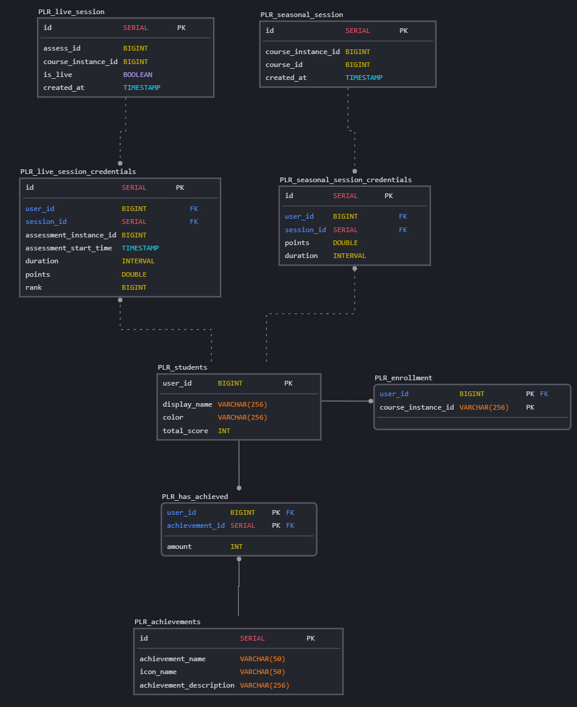

# DB Schema/Table Description
PrairieLearn's database uses a migration system. This means that each update to the DB needs to be in a small segmented SQL file. Our migrations are isolate [here](./migrations) as well as in PrairieLearn-Ranked's migration folder. A more in depth explation can be found in the [PL migration readme](https://github.com/PrairieLearn/PrairieLearn/blob/master/apps/prairielearn/src/migrations/README.md).

Each migration needs a **unique** timestamp before being inserted into PL migrations folder and those timestamps can be generate with this command:

`node -e "console.log(new Date().toISOString().replace(/\D/g,'').slice(0,14))"`

The folders need the following format {timestamp}\_{create name} as described in the [PL migration readme](https://github.com/PrairieLearn/PrairieLearn/blob/master/apps/prairielearn/src/migrations/README.md).


---

## Staff View Select Assessments

Note: this will require courseInstanceId to be passed as an arg

```sql
    SELECT
        assessments.title, assessments.id, assessments.course_instance_id
    FROM
        assessments JOIN assessment_sets
        ON assessments.assessment_set_id = assessment_sets.id
    WHERE
        assessment_sets.abbreviation = 'LV'
    AND
        assessments.course_instance_id = $1;
    const { rows } = await pool.query(selectStudentIdQuery, [
      courseInstanceId
    ]);
```

---

## ER Diagram



---

# Tables

## Table: PLR_students

This table represents our students.

| Column       | Type         | Description                    |
| ------------ | ------------ | ------------------------------ |
| user_id      | BIGINT       | Primary key                    |
| display_name | VARCHAR(256) | Display name of the student    |
| color        | VARCHAR(256) | Color associated with the student |
| total_score  | INT          | Total score of the student      |

## Table: PLR_live_session

This table represents a live session and is connected to a specific assessment instance and course instance.

| Column             | Type         | Description                               |
| ------------------ | ------------ | ----------------------------------------- |
| id                 | SERIAL       | Primary key                               |
| assess_id          | BIGINT       | ID of assessment instance |
| course_instance_id | BIGINT       | Unique ID of course instance   |
| is_live            | BOOLEAN      | Indicates if the session is live          |
| created_at         | TIMESTAMP    | Timestamp of session creation             |

## Table: PLR_live_session_credentials

This table represents a student's live session credentials.

| Column                  | Type         | Description                                    |
| ----------------------- | ------------ | ---------------------------------------------- |
| id                      | SERIAL       | Primary key                                    |
| user_id                 | BIGINT       | Foreign key referencing student               |
| session_id              | BIGINT       | Foreign key referencing live session           |
| assessment_instance_id | BIGINT       | ID of assessment instance   |
| assessment_start_time  | TIMESTAMP    | Start time of the assessment                  |
| duration                | INTERVAL     | Duration of the session                        |
| points                  | DOUBLE PRECISION | Points scored by the student in the session   |
| rank                    | BIGINT       | Rank of the student in the session             |

## Table: PLR_seasonal_session

This table represents a semester.

| Column              | Type         | Description                         |
| ------------------- | ------------ | ----------------------------------- |
| id                  | SERIAL       | Primary key                         |
| course_instance_id  | BIGINT       | Unique ID for course instance |
| course_id           | BIGINT       | ID for course        |
| created_at          | TIMESTAMP    | Timestamp of session creation       |

## Table: PLR_seasonal_session_credentials

This table represents a student's credentials for a semester.

| Column        | Type         | Description                    |
| ------------- | ------------ | ------------------------------ |
| id            | SERIAL       | Primary key                    |
| user_id       | BIGINT       | Foreign key referencing student |
| session_id    | INT          | Foreign key referencing session |
| points        | DOUBLE PRECISION | Points scored by the student    |
| duration      | INTERVAL     | Duration of the session        |

## Table: PLR_achievements

This table represents the achievements that a student can win.

| Column                | Type         | Description                    |
| --------------------- | ------------ | ------------------------------ |
| id                    | SERIAL       | Primary key                    |
| achievement_name      | VARCHAR(50) | Name of the achievement        |
| icon_name             | VARCHAR(50) | Name of the achievement icon   |
| achievement_description | VARCHAR(256) | Description of the achievement |

## Table: PLR_has_achieved

This table represents the achievements that a student has won.

| Column          | Type         | Description                  |
| --------------- | ------------ | ---------------------------- |
| user_id         | BIGINT       | Foreign key referencing student |
| achievement_id  | BIGINT       | Foreign key referencing achievement |
| amount          | INT          | Amount of the achievement    |
| user_id, achievement_id | | Partial primary keys |

## Table: PLR_enrollment

This table represents what courses a student is enrolled in.

| Column          | Type         | Description                    |
| --------------- | ------------ | ------------------------------ |
| user_id         | BIGINT       | Foreign key referencing student |
| course_instance_id | VARCHAR(256) | ID for course instance |
| user_id, course_instance_id | | Partial primary keys |

---

# Triggers and Functions
## 1. `insert_student_from_users()` Function and `trigger_insert_student` Trigger

### Function Description
The `insert_student_from_users()` function is designed to insert a new student record into the `PLR_students` table whenever a new student is added to PrairieLearn's primary `users` table.

### Trigger Context
The associated trigger, `trigger_insert_student`, activates `AFTER INSERT` on the `users` table.

### Functionality
When a new student is added to PrairieLearn's `users` table, this function and trigger combination ensures that the same student, with their user ID and name, is also added to the `PLR_students` table.


## 2. `set_plr_enrollment()` Function and `trigger_update_or_insert_enrollment` Trigger

### Function Description
The `set_plr_enrollment()` function inserts a new student enrollment record into the `plr_enrollment` table based on new rows in PrairieLearn's `enrollments` table.

### Trigger Context
The associated trigger, `trigger_update_or_insert_enrollment`, activates `AFTER INSERT` on the `enrollments` table.

### Functionality
When a new student enrollment is added to PrairieLearn's `enrollments` table, this function attempts to add the same enrollment to the `plr_enrollment` table. If a record with the same user ID and course instance ID already exists in `plr_enrollment`, the function does nothing, ensuring there are no primary key violations.


## 3. `send_notification()` Function and `notify_plr_live_credentials_change` Trigger

### Function Description
The `send_notification()` function is specifically designed to send notifications whenever there are updates or new data inserted into the `PLR_live_session_credentials` table. This function sends out a PostgreSQL `NOTIFY` signal, which can be listened to by external services or clients.

### Trigger Context
The associated trigger, `notify_plr_live_credentials_change`, is activated `AFTER UPDATE OR INSERT` on the `PLR_live_session_credentials` table.

### Functionality
Upon each update or insert into the `PLR_live_session_credentials` table, the `send_notification` function is invoked, which in turn sends a PostgreSQL `NOTIFY` signal with the name `table_change_notification`. The actual payload of the notification is kept empty.

### Server and Client Interaction
On the server side, there's a client listener specifically set up to listen for these PostgreSQL notifications. Once this listener captures a notification, the server then uses Server-Sent Events (SSE) to communicate these changes to the route handler. Subsequently, the client receives this SSE and can respond accordingly, enabling real-time, asynchronous functionality and interactivity for end-users.


## 4. `update_total_score()` Function and `seasonal_credential_update_trigger` Trigger

### Function Description
The `update_total_score()` function is designed to incrementally update the `total_score` for a student in the `PLR_students` table. This occurs every time a student's score changes in the `PLR_seasonal_session_CREDENTIALS` table.

### Trigger Context
The associated trigger, `seasonal_credential_update_trigger`, is activated `AFTER INSERT OR UPDATE` on the `PLR_seasonal_session_CREDENTIALS` table.

### Functionality
When a new score is either inserted or updated in the `PLR_seasonal_session_CREDENTIALS` table, the `update_total_score` function is invoked. This function then updates the `total_score` field in the `PLR_students` table by adding the new points to the current `total_score` of the corresponding student, identified by the `user_id`.

### Impact
This setup ensures that the `total_score` in the `PLR_students` table remains up-to-date, reflecting the cumulative score of each student over time, as they progress and earn points in different seasonal sessions.


## 5. `move_to_seasonal_session()` Function and `trg_move_to_seasonal_session` Trigger

### Function Description
The `move_to_seasonal_session()` function facilitates the transfer of data from a live session to a seasonal session. When a live session is closed (`is_live` is set to `FALSE`), this function is responsible for ensuring that all relevant data from that live session is correctly and efficiently mirrored into the seasonal session tables.

### Trigger Context
The associated trigger, `trg_move_to_seasonal_session`, activates `AFTER` an `UPDATE` of the `is_live` field on the `PLR_live_session` table.

### Functionality
1. **Update Seasonal Session Data**: 
   - When a live session is closed, the function first attempts to insert a corresponding entry into the `PLR_seasonal_session` table.
   - If a matching entry based on `course_instance_id` already exists, the function does nothing to avoid any conflicts.

2. **Transfer Live Session Credentials**:
   - The function iterates through all credentials associated with the closed live session.
   - For each credential:
     - If the student (`user_id`) already has an entry in the `PLR_seasonal_session_credentials` table for the current session, the function will update the points and duration for that entry.
     - If the student doesn't have an entry, a new one is created with the corresponding points, duration, and other relevant data.

### Impact
This setup guarantees that when a live session concludes, all the relevant student data (like points earned and duration spent) is transferred to the seasonal tables. This archival process ensures that the system can differentiate between live and historical data while keeping a robust record of student activity across different sessions.


### 6. `update_score_and_rank()` Function and Trigger

#### Description:
The core of PrairieLearn's live session scoring system is managed by the `update_score_and_rank()` function and its associated trigger. This mechanism ensures that scores, durations, and ranks of students in live sessions are dynamically updated based on their assessments.

#### Functionality:

1. **Checking Existing Assessment Instance**:
   - Initially, the function verifies if the student has already begun an assessment instance in the ongoing live session.
   - If an existing assessment instance is detected for the student, the function proceeds to update their score and the total duration spent on the assessment. The score is adjusted by multiplying the student's points by 3628.

2. **Verifying Live Session Attachment**:
   - If the student's assessment is newly initiated, the function checks if the assessment is associated with an active live session.
   - If such a session exists, a new record for the student is inserted into the `PLR_live_session_credentials` table, capturing the student's points, the session ID, the start time of the assessment, the student's ID, and the assessment instance ID.

3. **Ranking the Students**:
   - Using the `RANK()` window function, students are ranked based on their scores (highest to lowest) and, in case of ties, by their assessment durations (shortest to longest).
   - The `PLR_live_session_credentials` table is then updated with the computed ranks.

#### Trigger:

- **`trigger_update_assessment_instances`**: It vigilantly monitors the `assessment_instances` table for any new insertions or updates. Upon detecting such changes, it triggers the `update_score_and_rank()` function to recalculate and update the scores, durations, and ranks of students in the corresponding live session.

#### Impact:
The `update_score_and_rank()` function and its trigger are pivotal to maintaining a real-time leaderboard in PrairieLearn's live sessions. They ensure that students' scores are immediately reflected, fostering a competitive and engaging learning environment.


## Achievements Triggers

### 1. Placement achievements: `assign_medals()` Function and `assign_medals_trigger` Trigger

#### Function Description
The `assign_medals()` function is responsible for awarding medals to the top 3 students in a live session once that session has concluded. These medals are categorized as gold, silver, and bronze for the top 1st, 2nd, and 3rd placed students respectively.

#### Trigger Context
The associated trigger, `assign_medals_trigger`, activates `AFTER` an `UPDATE` of the `is_live` field on the `PLR_live_session` table, specifically when a live session transitions from active (`TRUE`) to inactive (`FALSE`).

#### Functionality
1. **Identify Top 3 Students**: 
   - The function starts by identifying the top 3 students in the concluded live session based on their rank.
   - These students are selected in ascending order of their rank, effectively selecting the best performers.

2. **Award Medals**:
   - The function then iterates through these top 3 students:
     - The top student (rank 1) is awarded the gold medal.
     - The second top student (rank 2) is awarded the silver medal.
     - The third top student (rank 3) is awarded the bronze medal.

3. **Update Achievements Table**:
   - The medals are then recorded in the `PLR_has_achieved` table. 
   - If a student has already received the medal in a previous session, the function ensures no duplicates are created.

#### Impact
This setup ensures that the top-performing students in a live session are immediately recognized and awarded for their achievements, fostering a competitive and rewarding environment.


### 2. `check_hat_trick()` Function and `check_hat_trick_trigger` Trigger

#### Function Description
The `check_hat_trick()` function is designed to identify and reward students who have secured the top rank (rank 1) in three consecutive sessions of the same course. This achievement is akin to a "hat trick" in sports, symbolizing consistent top performance across multiple sessions.

#### Trigger Context
The associated trigger, `check_hat_trick_trigger`, activates `AFTER` an `UPDATE` on the `PLR_live_session` table. Specifically, it listens for changes in the `is_live` column, identifying when a live session transitions from active (`TRUE`) to inactive (`FALSE`).

#### Functionality
1. **Identify Session Closure**:
   - Initially, the function checks if a session has just concluded by detecting a change in `is_live` from `true` to `false`.

2. **Fetch Top Students of Last Three Sessions**:
   - If a session has concluded, the function identifies the top-ranking students (rank 1) from the last three sessions of the same course instance.
   - This is done using a subquery that fetches session IDs for the given `course_instance_id`, ordered by their creation date.

3. **Identify Hat Trick Achievers**:
   - The function then checks if the same student has secured the top rank in all three sessions.
   - It also ensures that the student hasn't already been awarded the hat trick achievement.

4. **Update Achievements Table**:
   - If all conditions are met, the student's achievement is recorded in the `PLR_has_achieved` table with an `achievement_id` of 4, representing the hat trick achievement.

#### Impact
This mechanism ensures that consistently high-performing students across multiple sessions are recognized and rewarded, encouraging sustained effort and excellence in the course.


### 3. `gotta_go_fast()` Function and `gotta_go_fast_trigger` Trigger

#### Function Description
The `gotta_go_fast()` function is designed to recognize and award the student who completes an assessment in the shortest time during a live session. This achievement, aptly named "Gotta Go Fast", celebrates efficiency and speed in problem-solving during a session.

#### Trigger Context
The associated trigger, `gotta_go_fast_trigger`, is activated `AFTER` an `UPDATE` on the `plr_live_session` table. It specifically responds to changes in the `is_live` column, particularly when a session is marked as closed (changed from `true` to `false`).

#### Functionality
1. **Determine Fastest Completion**:
   - The function identifies the student with the shortest assessment completion duration from the `plr_live_session_credentials` table for the closed session.

2. **Award Achievement**:
   - Before awarding the achievement, the function checks if the student has previously received the "Gotta Go Fast" achievement for this specific session.
   - If the student hasn't been awarded yet, their achievement is recorded in the `plr_has_achieved` table with an `achievement_id` of 5, representing the "Gotta Go Fast" achievement.

#### Impact
This mechanism provides positive reinforcement to students who excel in time-efficient problem-solving during a live session. Recognizing and rewarding such achievements can foster a competitive and motivating environment among students, pushing them to strive for efficiency in their work.


### 4. `speed_demon_achievement()` Function and `speed_demon_achievement_trigger` Trigger

#### Function Description
The `speed_demon_achievement()` function is designed to recognize and reward students who consistently exhibit rapid completion times in their assessments across multiple sessions. Specifically, it identifies students who have achieved the shortest duration in five consecutive sessions of the same course.

#### Trigger Context
The associated trigger, `speed_demon_achievement_trigger`, activates `AFTER` an `UPDATE` on the `plr_live_session` table. The trigger responds to changes in the `is_live` column, specifically when a session transitions to an inactive state (`FALSE`).

#### Functionality
1. **Identify Shortest Duration for Current Session**:
   - The function first identifies the entry in `plr_live_session_credentials` with the shortest duration for the current session.

2. **Examine Previous Sessions**:
   - It then examines the previous four sessions for the same course instance to see if the same student also had the shortest completion time in those sessions.

3. **Award Achievement**:
   - If the same student had the shortest duration in all five sessions (the current and the previous four), the function then checks if this student has already been awarded the "Speed Demon" achievement.
   - If not, the student's achievement is recorded in the `plr_has_achieved` table with an `achievement_id` of 6, signifying the "Speed Demon" achievement.

#### Impact
This mechanism ensures that students who consistently complete their assessments in the shortest time across sessions are recognized and rewarded. This can motivate students to understand course material efficiently and showcase their rapid problem-solving skills.


### 5. `remove_aot_achievement()` and `insert_aot_achievement()` Functions with their Triggers

#### Description:
The "Always On Time" achievement is designed to recognize students who consistently attend every live session. Two crucial functions and their corresponding triggers ensure the management of this achievement:

1. **`remove_aot_achievement()`** - Removes the achievement if a student misses a live session.
2. **`insert_aot_achievement()`** - Inserts the achievement when a new student is created, indicating the expectation that they'll be always on time.

#### Functionality:

1. **Identifying Absent Students**:
   - Upon the conclusion of a live session (`is_live` changes to `false`), the `remove_aot_achievement()` function identifies students who were expected to attend but didn't.
   - It does so by comparing `plr_students` (who are expected to attend) with actual attendees from `plr_live_session_credentials`.
   
2. **Removing Achievement**:
   - If a student who previously had the "Always On Time" achievement is found to have missed a session, the achievement is removed from the `plr_has_achieved` table.

3. **Assigning Achievement to New Students**:
   - When a new student is added to `plr_students`, the `insert_aot_achievement()` function automatically grants them the "Always On Time" achievement. This sets the expectation for them to maintain this status by attending all sessions.

#### Triggers:

- **`remove_aot_achievement_trigger`**: Listens to `plr_live_session` table for changes in `is_live` column, activating the `remove_aot_achievement()` function.
  
- **`insert_aot_achievement_trigger`**: Activated `AFTER INSERT` on the `plr_students` table, calling the `insert_aot_achievement()` function to grant new students the achievement.

#### Impact:
The "Always On Time" achievement system encourages students to maintain consistent attendance and participation in live sessions. The dynamic addition and removal of this achievement serve as a motivation for students to avoid missing sessions, ensuring active participation and consistency.


### 6. `unstoppable_achievement()` Function and Trigger

#### Description:
The "Unstoppable" achievement is a testament to a student's consistent performance, reserved for those who achieve the top rank in five consecutive live sessions. The `unstoppable_achievement()` function and its corresponding trigger manage the awarding of this prestigious achievement.

#### Functionality:

1. **Determining Top Students**:
   - When a live session concludes (signified by `is_live` changing to `false`), the function identifies the student who secured the top rank in that session.
   
2. **Checking Past Records**:
   - The function then checks the rankings of the top student in the four previous live sessions associated with the same `course_instance_id`.
   - If the student has been consistently ranked first across these sessions, a counter is incremented.
   
3. **Awarding Achievement**:
   - If the counter reflects that the student maintained the top rank across five sessions (including the current one), they are granted the "Unstoppable" achievement.
   - The achievement is added to the `plr_has_achieved` table, unless the student already possesses it.

#### Trigger:

- **`unstoppable_achievement_trigger`**: It listens to the `plr_live_session` table for changes in the `is_live` column. When a session concludes, it activates the `unstoppable_achievement()` function to check and possibly award the achievement.

#### Impact:
The "Unstoppable" achievement recognizes and rewards excellence, motivating students to consistently strive for the top position in their live sessions. Through this dynamic system, students have a tangible goal that promotes competitive spirit and continuous improvement.

