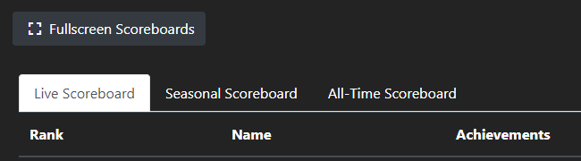

# Frontend and Routing Guide

Welcome to the frontend and routing guide, where we demystify the architecture of both student (`plrStudent`) and staff (`plrStaff`) pages. In this guide, you'll find details about the user interfaces, interactive features, and underlying technical mechanics that power the student and staff experiences.

## Student Page UI

Here's a quick look at some features that are accessible to students:

### Achievements

- **Viewing Achievements**: Hover over the badges in the profile section to get a brief description of how you can earn them.


### Personalizing Your Profile

- **Changing Your Display Name**: Simply input a new name in the text box on the profile card and click the "Change Name" button. Don't worry, our profanity checker ensures that only appropriate names are used.


## Staff Page UI

If you're a staff member, you have access to some exclusive features:

### Presenter Mode

- **Fullscreen Scoreboard**: Click the "Fullscreen" button near the top of the live scoreboard tab to view the top students in all their glory. Press "Esc" to return to the regular view.



### Quiz Management

- **Starting and Stopping Quizzes**: Click a specific quiz to activate it (the button will turn red), and all other quizzes will be disabled to prevent multiple live sessions. Click the quiz button again to deactivate it.


---

## Technical Descriptions

Let's dive into the technical details, exploring the differences between the student (`plrStudent.js`) and staff pages (`plrStaff.js`), and understanding the routing mechanisms.

### Shared Features

Both student and staff pages leverage the same code and routes for scoreboard functionality, but with unique twists:

- **Staff Page**: Features a route for updating quiz status (live or inactive).
- **Student Page**: Includes routes for changing the display name.

### Live Scoreboard Updates

A standout feature in the `plrStudent.js` file is the `/live-updates` route:

```js
router.get('/live_updates', (req, res) => {
  res.setHeader('Content-Type', 'text/event-stream');
  res.setHeader('Cache-Control', 'no-cache');
  res.setHeader('Connection', 'keep-alive');

  const clientRes = sseClients.addClient(res);

  req.on('close', () => {
    sseClients.removeClient(clientRes);
  });

  res.flushHeaders();
});
```

This route employs SSE (Server-Sent Events), enabling real-time updates without continuous client requests. It's a simpler alternative to websockets and is unidirectional, fitting our need for a one-way communication channel. This approach powers the live scoreboard, providing an efficient and seamless real-time update experience.
