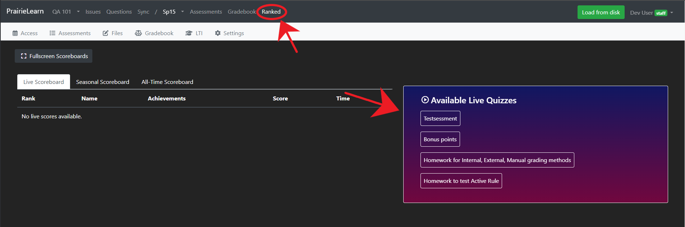

# PrairieLearn Ranked Walkthrough

Welcome to PrairieLearn Ranked, an exciting extension of the PrairieLearn platform designed to enhance your teaching experience. With the new "Ranked" feature, you can create "live assessments" that are both timed and ranked, allowing students to see their real-time standings. This guide will walk you through the seamless process of setting up and running a live assessment.

## Preparing Live Assessments

### Step 1 - Create the Assessment

Create an assessment using PrairieLearn's familiar interface. If you need guidance, you can refer to the official [PrairieLearn Assessment Documentation](https://prairielearn.readthedocs.io/en/latest/assessment/).

### Step 2 - Link to the Live Assessment Set

#### 2.1 - Creating the assessment set.

If the Live Assessment set is not present in your course instance, please add it by following these steps:
1. Navigate to your course within the file structure, typically found under the root PrairieLearn directory.
2. Open the file `infoCourse.json` within your course directory.
3. Locate or add the `assessmentSets` section as shown below:

```json
"assessmentSets": [
    {
        "abbreviation": "LV",
        "name": "Live Assessment",
        "heading": "Live Assessments",
        "color": "red3"
    }
]
```

> NOTE: this only needs to be done once per course.

#### Step 2.2 - Attaching the assessment to the set

Assign the **set** value of your assessment to `Live Assessment`. This tells our system to monitor submissions for these particular assignments. This can be seen below:

```JSON
    "uuid": "{Generated uuid}",
    "type": "{Your Type}",
    "title": "{Name of your Assessment}",
    "set": "Live Assessment",
    "number": "{Generated Assessment Number}",
    "allowAccess": [],
    "zones": []
```

### Step 3 - Set the Assessment Time

Ensure that the assessment's time aligns with your class schedule. Precise timing is crucial. Incorrect timing may lead to confusion on the student scoreboard —  if the assessment is open, then students could attempt the assessment, and nothing will appear on the scoreboard for them. Instructions for managing times through access control are available [here](https://prairielearn.readthedocs.io/en/latest/accessControl/).

## Running the Live Session

### Step 4 - Starting the Live Session

Your assessment is ready for action! Locate the Ranked tab in the navbar of your course instance. Admin access will reveal live assessments ready for selection. Once chosen, the assessment button will turn red, indicating a live state. Remember, only one assessment can be live simultaneously.



Make sure to initiate the live session just a bit ahead of time, before the live assessment officially becomes available to students. If the assessment goes live *before* activating the corresponding session button, the live scoreboard won't reflect any updates. However, don't worry if some students jump the gun—once the scoreboard is activated, it will retroactively update with scores from students who began their assessment before the live session button was clicked.

### Step 5 - The Live Session

The live scoreboard will now reflect student submissions. Students can proceed as they would with any other assessment. If desired, you can showcase the real-time scoreboard to your class using the fullscreen mode.

### Step 6 - Closing the Live Session

To close the session, click the red live assessment button on the Ranked staff page. This action halts the submission of points to the scoreboard. Upon refreshing, points transfer to the seasonal scoreboard, and students earn achievements based on performance.

### Troubleshooting & Additional Information

- If a session is live, and for whatever reason, the PrairieLearn build goes down... Upon page reload, an assessment may still be **highlighted**, but **not actually live**. If this is the case, go into the browser console and input the following command: `localStorage.clear();`. This will clear the highlighting.
- If viewing from an account that has the ability to **swap between staff and student** modes, changing roles from the ranked page will cause issues. If you get an error after swapping roles, revert to your previous role, and go back to the course instance assessment page to change roles.
